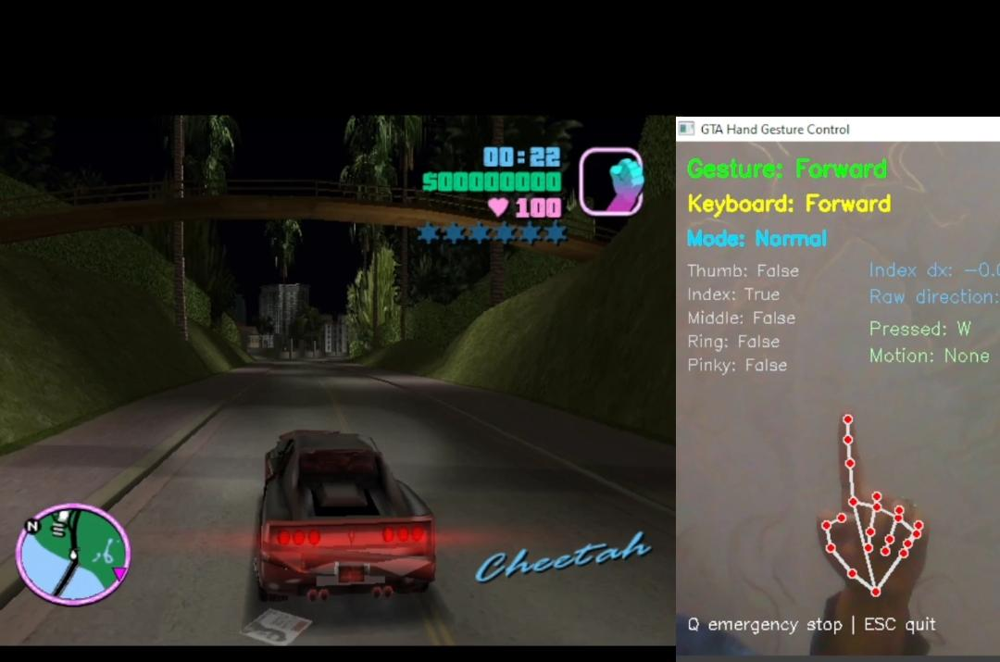

# GTA V Hand Gesture Control

Real-time hand-gesture control for classic PC versions of GTA Vice City and GTA San Andreas.

**Author:** Gohar Fatima

This project is distributed under the MIT License. The license file preserves required third-party attribution for adapted portions; the current controller, camera handling, gesture smoothing, safety behavior, mappings, documentation, and Windows setup are maintained by Gohar Fatima.

## Features

- MediaPipe hand-landmark detection with rule-based gesture recognition.
- DirectShow-first webcam initialization with backend, index, resolution, and warm-up fallback.
- Stable gesture confirmation and safe release of held inputs.
- Movement, jump, crouch, sprint, aim, shoot, punch, vehicle, handbrake, weapon, and pause controls.
- Configurable keyboard and mouse mappings.
- Emergency stop with automatic cleanup.
- Safe keyboard mapping test that never sends input.

## Setup

Windows, Python 3.8, a working webcam, and GTA running windowed or borderless are required.

```powershell
git clone https://github.com/GoharCh453/GTA-Gesture-Control.git
cd GTA-Gesture-Control/GtaV-Control
py -3.8 -m venv .venv
.\.venv\Scripts\Activate.ps1
Set-ExecutionPolicy -Scope Process Bypass
.\setup.ps1
python control.py
```

`setup.ps1` installs the GUI-capable OpenCV wheel and avoids conflicting headless/contrib camera packages.

## Gesture Mapping

| Gesture | Action | Default input |
| --- | --- | --- |
| Index only | Forward | W |
| Middle, ring, pinky | Backward | S |
| Pinky only | Left | A |
| Middle only | Right | D |
| Index + middle | Jump pulse | Space |
| Index + ring | Crouch | C |
| Index + middle + ring | Sprint | W + Shift |
| Thumb + index | Aim | Mouse right |
| Thumb only | Enter/exit vehicle | F |
| Aim + push | Shoot | Mouse left |
| Fist + push | Punch/attack | Mouse left |
| Thumb + middle | Next weapon | E |
| Thumb + ring | Previous weapon | Z |
| Thumb + index + middle + ring | Pause | P |

Q is the emergency stop. ESC exits the controller. Unknown gestures, a lost hand, camera failure, and exit release all held inputs.

## Safe Test

```powershell
python keyboard_test.py
```

This verifies Left, Right, Backward, and Jump mappings without sending keyboard or mouse events.

## License and Attribution

The live controller is maintained by Gohar Fatima. See [LICENSE](LICENSE) for the complete legal notice.

## Project Demo

